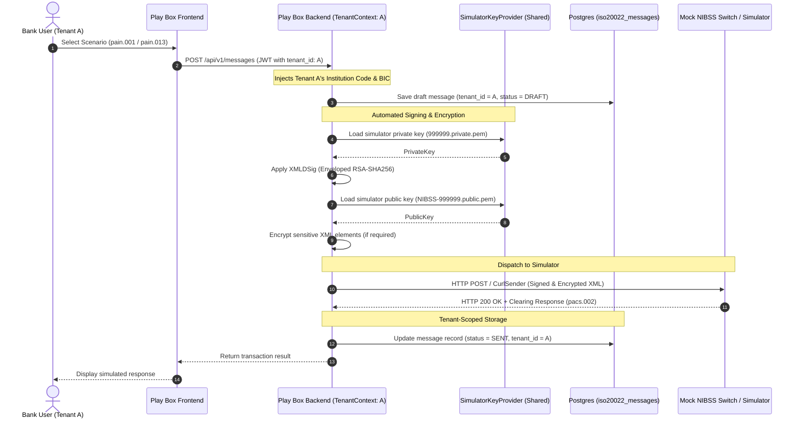

# Phase 10: ISO 20022 Message Tenant Isolation & Simulator Key Architecture

## Objective
Implement comprehensive tenant isolation for all ISO 20022 message processing, test scenarios, validation results, and pseudo-bank identity profiles. In this simulator sandbox environment, participating institutions operate as **pseudo-banks** using **shared, pre-configured simulator keys** (`999999.private.pem` and `NIBSS-999999.public.pem`) managed transparently at the platform level. This eliminates per-institution PKI key collection and certificate onboarding friction while strictly enforcing tenant data boundaries for all message records, execution history, and audit trails.

**Duration**: 4-5 days  
**Dependencies**: Phase 1 (Multi-Tenant Database Foundation), Phase 2 (Tenant-Aware Authentication)

---

## Simulator Key Architecture & Pseudo-Bank Model

### Design Rationale

1. **Sandbox / Simulator Pragmatism**: In a payments testing sandbox (NPS Play Box), requiring institutions to generate, upload, and rotate X.509 certificates and RSA private keys causes immense onboarding friction.
2. **Mock Switch Alignment**: The receiving mock clearing switch (e.g. NIBSS simulator) is pre-configured with known public keys. Using a centralized simulator key pair ensures that messages signed by any pseudo-bank are automatically verifiable by the mock switch without needing custom truststore updates on the switch for every tenant.
3. **Identity vs. Cryptography**:
   - **Identity** is tenant-specific: Each tenant configures their own **Pseudo-Bank Profile** (Institution Code e.g. `090004`, `999057`, BIC, Bank Name, Default Test Accounts).
   - **Cryptography** is platform-managed: The platform signs and encrypts payloads automatically using the shared simulator keys.
   - **Data Boundaries** are strictly isolated: All message records, test scenarios, validation reports, and callbacks are isolated by `tenant_id` in the database.



---

## Database Schema Changes

### 10.1 Create ISO 20022 Messages Table

```sql
CREATE TABLE iso20022_messages (
    id BIGSERIAL PRIMARY KEY,
    tenant_id BIGINT NOT NULL,
    message_uuid UUID UNIQUE NOT NULL DEFAULT gen_random_uuid(),
    message_type VARCHAR(100) NOT NULL,
    message_code VARCHAR(50) NOT NULL,
    direction VARCHAR(20) NOT NULL,
    
    -- Message content
    raw_xml TEXT NOT NULL,
    signed_xml TEXT,
    encrypted_xml TEXT,
    
    -- Processing metadata
    status VARCHAR(50) NOT NULL DEFAULT 'DRAFT',
    created_by BIGINT NOT NULL,
    processed_at TIMESTAMP,
    sent_at TIMESTAMP,
    received_at TIMESTAMP,
    
    -- Transaction tracking & correlation
    transaction_reference VARCHAR(255),
    end_to_end_id VARCHAR(255),
    message_id VARCHAR(255),
    
    -- Audit fields
    created_at TIMESTAMP NOT NULL DEFAULT CURRENT_TIMESTAMP,
    updated_at TIMESTAMP NOT NULL DEFAULT CURRENT_TIMESTAMP,
    metadata JSONB,
    
    CONSTRAINT fk_messages_tenant FOREIGN KEY (tenant_id) REFERENCES tenants(id) ON DELETE CASCADE,
    CONSTRAINT fk_messages_creator FOREIGN KEY (created_by) REFERENCES users(id),
    CONSTRAINT chk_message_type CHECK (message_type IN (
        'PAYMENT_INITIATION', 'PAYMENT_ACTIVATION', 'PAYMENT_STATUS',
        'MANDATE_CREATION', 'MANDATE_AMENDMENT', 'MANDATE_CANCELLATION',
        'DIRECT_DEBIT', 'CUSTOMER_DIRECT_DEBIT', 'PAYMENT_RETURN',
        'ACCOUNT_REPORT', 'BANK_STATEMENT', 'BALANCE_ENQUIRY',
        'NAME_VERIFICATION', 'TRANSFER'
    )),
    CONSTRAINT chk_direction CHECK (direction IN ('INBOUND', 'OUTBOUND')),
    CONSTRAINT chk_status CHECK (status IN (
        'DRAFT', 'VALIDATED', 'SIGNED', 'ENCRYPTED', 
        'SENT', 'DELIVERED', 'FAILED', 'REJECTED'
    ))
);

CREATE INDEX idx_messages_tenant_id ON iso20022_messages(tenant_id);
CREATE INDEX idx_messages_tenant_type ON iso20022_messages(tenant_id, message_type);
CREATE INDEX idx_messages_tenant_status ON iso20022_messages(tenant_id, status);
CREATE INDEX idx_messages_transaction_ref ON iso20022_messages(tenant_id, transaction_reference);
CREATE INDEX idx_messages_msg_id ON iso20022_messages(message_id);
CREATE INDEX idx_messages_end_to_end ON iso20022_messages(end_to_end_id);
CREATE INDEX idx_messages_created_at ON iso20022_messages(tenant_id, created_at DESC);
```

### 10.2 Create Tenant Simulator Profiles Table

Instead of storing individual private keys and certificates per tenant, each tenant configures their pseudo-bank operational attributes:

```sql
CREATE TABLE tenant_simulator_profiles (
    id BIGSERIAL PRIMARY KEY,
    tenant_id BIGINT UNIQUE NOT NULL,
    profile_uuid UUID UNIQUE NOT NULL DEFAULT gen_random_uuid(),
    
    -- Pseudo-Bank Identification
    institution_code VARCHAR(20) NOT NULL,           -- e.g., '090004', '999057'
    institution_name VARCHAR(255) NOT NULL,          -- e.g., 'Zenith Bank Simulator'
    bic VARCHAR(50) NOT NULL,                        -- e.g., 'ZEIBNGLAXXX'
    scheme_code VARCHAR(50),                         -- e.g., '999057'
    
    -- Default Account Settings for Mock Flows
    default_currency VARCHAR(3) NOT NULL DEFAULT 'NGN',
    default_account_number VARCHAR(50),
    default_account_name VARCHAR(255),
    default_bvn VARCHAR(20),
    
    -- Dispatch & Simulator Routing
    callback_url VARCHAR(500),                       -- Webhook for async clearing notifications
    auto_respond_inbound BOOLEAN NOT NULL DEFAULT TRUE, -- Auto-generate response if counterparty
    
    -- Audit
    updated_by BIGINT,
    created_at TIMESTAMP NOT NULL DEFAULT CURRENT_TIMESTAMP,
    updated_at TIMESTAMP NOT NULL DEFAULT CURRENT_TIMESTAMP,
    
    CONSTRAINT fk_sim_profiles_tenant FOREIGN KEY (tenant_id) REFERENCES tenants(id) ON DELETE CASCADE,
    CONSTRAINT fk_sim_profiles_updater FOREIGN KEY (updated_by) REFERENCES users(id)
);

CREATE INDEX idx_sim_profiles_tenant_id ON tenant_simulator_profiles(tenant_id);
CREATE INDEX idx_sim_profiles_inst_code ON tenant_simulator_profiles(institution_code);
```

### 10.3 Create Test Scenarios Table

```sql
CREATE TABLE test_scenarios (
    id BIGSERIAL PRIMARY KEY,
    tenant_id BIGINT NOT NULL,
    scenario_uuid UUID UNIQUE NOT NULL DEFAULT gen_random_uuid(),
    
    -- Scenario details
    scenario_name VARCHAR(255) NOT NULL,
    scenario_description TEXT,
    message_type VARCHAR(100) NOT NULL,
    test_category VARCHAR(100) NOT NULL,
    
    -- Test data
    input_data JSONB NOT NULL,
    expected_output JSONB,
    validation_rules JSONB,
    
    -- Status and results
    status VARCHAR(50) NOT NULL DEFAULT 'DRAFT',
    last_run_at TIMESTAMP,
    last_run_status VARCHAR(50),
    execution_count INTEGER DEFAULT 0,
    
    -- Audit
    created_by BIGINT NOT NULL,
    created_at TIMESTAMP NOT NULL DEFAULT CURRENT_TIMESTAMP,
    updated_at TIMESTAMP NOT NULL DEFAULT CURRENT_TIMESTAMP,
    
    CONSTRAINT fk_scenarios_tenant FOREIGN KEY (tenant_id) REFERENCES tenants(id) ON DELETE CASCADE,
    CONSTRAINT fk_scenarios_creator FOREIGN KEY (created_by) REFERENCES users(id),
    CONSTRAINT chk_scenario_status CHECK (status IN ('DRAFT', 'ACTIVE', 'ARCHIVED')),
    CONSTRAINT chk_test_category CHECK (test_category IN (
        'FUNCTIONAL', 'VALIDATION', 'INTEGRATION', 
        'PERFORMANCE', 'SECURITY', 'REGRESSION'
    )),
    CONSTRAINT uq_tenant_scenario_name UNIQUE (tenant_id, scenario_name)
);

CREATE INDEX idx_scenarios_tenant_id ON test_scenarios(tenant_id);
CREATE INDEX idx_scenarios_tenant_type ON test_scenarios(tenant_id, message_type);
CREATE INDEX idx_scenarios_tenant_category ON test_scenarios(tenant_id, test_category);
CREATE INDEX idx_scenarios_tenant_status ON test_scenarios(tenant_id, status);
```

### 10.4 Create Validation Results Table

```sql
CREATE TABLE validation_results (
    id BIGSERIAL PRIMARY KEY,
    tenant_id BIGINT NOT NULL,
    result_uuid UUID UNIQUE NOT NULL DEFAULT gen_random_uuid(),
    
    -- Associated entities
    message_id BIGINT,
    scenario_id BIGINT,
    
    -- Validation details
    validation_type VARCHAR(100) NOT NULL,
    validation_engine VARCHAR(100) NOT NULL,
    
    -- Results
    is_valid BOOLEAN NOT NULL,
    error_count INTEGER DEFAULT 0,
    warning_count INTEGER DEFAULT 0,
    errors JSONB,
    warnings JSONB,
    
    -- Processing info
    execution_time_ms INTEGER,
    validated_at TIMESTAMP NOT NULL DEFAULT CURRENT_TIMESTAMP,
    validated_by BIGINT NOT NULL,
    
    -- XML snapshots
    validated_xml TEXT,
    
    CONSTRAINT fk_validation_tenant FOREIGN KEY (tenant_id) REFERENCES tenants(id) ON DELETE CASCADE,
    CONSTRAINT fk_validation_message FOREIGN KEY (message_id) REFERENCES iso20022_messages(id) ON DELETE CASCADE,
    CONSTRAINT fk_validation_scenario FOREIGN KEY (scenario_id) REFERENCES test_scenarios(id) ON DELETE CASCADE,
    CONSTRAINT fk_validation_user FOREIGN KEY (validated_by) REFERENCES users(id),
    CONSTRAINT chk_validation_type CHECK (validation_type IN (
        'SCHEMA', 'BUSINESS_RULES', 'NIBSS_RULES', 
        'SECURITY', 'COMPREHENSIVE'
    )),
    CONSTRAINT chk_validation_engine CHECK (validation_engine IN (
        'XSD', 'NIBSS_VALIDATOR', 'CUSTOM', 'COMBINED'
    ))
);

CREATE INDEX idx_validation_tenant_id ON validation_results(tenant_id);
CREATE INDEX idx_validation_message_id ON validation_results(tenant_id, message_id);
CREATE INDEX idx_validation_scenario_id ON validation_results(tenant_id, scenario_id);
CREATE INDEX idx_validation_tenant_type ON validation_results(tenant_id, validation_type);
CREATE INDEX idx_validation_tenant_valid ON validation_results(tenant_id, is_valid);
CREATE INDEX idx_validation_created_at ON validation_results(tenant_id, validated_at DESC);
```

---

## Migration Scripts

### 10.5 Migration: Add Tables & Default Profiles

```sql
-- Migration script: V10_1__create_iso20022_and_simulator_profile_tables.sql

BEGIN;

-- Ensure default tenant exists
INSERT INTO tenants (name, slug, status, max_seats, subscription_tier)
VALUES ('Default Simulator Bank', 'default-bank', 'ACTIVE', 100, 'ENTERPRISE')
ON CONFLICT (slug) DO NOTHING;

-- Seed default simulator profile for existing tenants that do not have one
INSERT INTO tenant_simulator_profiles (tenant_id, institution_code, institution_name, bic, scheme_code, default_currency)
SELECT 
    t.id,
    '999057',
    t.name || ' (Simulator)',
    'NIBSSNGLAXXX',
    '999057',
    'NGN'
FROM tenants t
WHERE NOT EXISTS (
    SELECT 1 FROM tenant_simulator_profiles p WHERE p.tenant_id = t.id
);

COMMIT;
```

### 10.6 Java Data Migration Script

```java
package org.example.signer.migration;

import lombok.RequiredArgsConstructor;
import lombok.extern.slf4j.Slf4j;
import org.springframework.jdbc.core.JdbcTemplate;
import org.springframework.stereotype.Component;
import org.springframework.transaction.annotation.Transactional;

import javax.annotation.PostConstruct;
import java.util.List;

@Slf4j
@Component
@RequiredArgsConstructor
public class Phase10DataMigration {

    private final JdbcTemplate jdbcTemplate;
    
    @PostConstruct
    @Transactional
    public void migrateLegacyData() {
        log.info("Starting Phase 10 data migration...");
        
        try {
            Long defaultTenantId = ensureDefaultTenant();
            seedSimulatorProfilesForAllTenants();
            migrateLegacyMessages(defaultTenantId);
            
            log.info("Phase 10 data migration completed successfully");
        } catch (Exception e) {
            log.error("Phase 10 data migration failed", e);
            throw new RuntimeException("Migration failed", e);
        }
    }
    
    private Long ensureDefaultTenant() {
        String sql = """
            INSERT INTO tenants (name, slug, status, max_seats, subscription_tier)
            VALUES ('Default Simulator Bank', 'default-bank', 'ACTIVE', 100, 'ENTERPRISE')
            ON CONFLICT (slug) DO UPDATE SET name = EXCLUDED.name
            RETURNING id
            """;
        
        return jdbcTemplate.queryForObject(sql, Long.class);
    }
    
    private void seedSimulatorProfilesForAllTenants() {
        String sql = """
            INSERT INTO tenant_simulator_profiles 
                (tenant_id, institution_code, institution_name, bic, scheme_code, default_currency, auto_respond_inbound)
            SELECT 
                t.id, 
                '999057', 
                t.name, 
                'SIMUNGLAXXX', 
                '999057', 
                'NGN',
                TRUE
            FROM tenants t
            WHERE NOT EXISTS (
                SELECT 1 FROM tenant_simulator_profiles WHERE tenant_id = t.id
            )
            """;
        int created = jdbcTemplate.update(sql);
        log.info("Initialized {} tenant simulator profiles", created);
    }
    
    private void migrateLegacyMessages(Long tenantId) {
        String checkTableSql = """
            SELECT EXISTS (
                SELECT FROM information_schema.tables 
                WHERE table_name = 'legacy_messages'
            )
            """;
        
        Boolean tableExists = jdbcTemplate.queryForObject(checkTableSql, Boolean.class);
        if (Boolean.TRUE.equals(tableExists)) {
            String migrateSql = """
                INSERT INTO iso20022_messages 
                    (tenant_id, message_type, message_code, direction, raw_xml, 
                     status, created_by, created_at, transaction_reference)
                SELECT 
                    ?, message_type, message_code, 'OUTBOUND', xml_content, 
                    status, user_id, created_at, reference
                FROM legacy_messages
                WHERE NOT EXISTS (
                    SELECT 1 FROM iso20022_messages 
                    WHERE transaction_reference = legacy_messages.reference
                )
                """;
            int count = jdbcTemplate.update(migrateSql, tenantId);
            log.info("Migrated {} legacy messages to tenant {}", count, tenantId);
        }
    }
}
```

---

## Backend Implementation

### 10.7 ISO 20022 Message Entity

```java
package org.example.signer.model;

import jakarta.persistence.*;
import lombok.AllArgsConstructor;
import lombok.Builder;
import lombok.Data;
import lombok.NoArgsConstructor;
import org.hibernate.annotations.Type;
import io.hypersistence.utils.hibernate.type.json.JsonBinaryType;

import java.time.LocalDateTime;
import java.util.UUID;

@Entity
@Table(name = "iso20022_messages", indexes = {
    @Index(name = "idx_messages_tenant_id", columnList = "tenant_id"),
    @Index(name = "idx_messages_tenant_type", columnList = "tenant_id,message_type"),
    @Index(name = "idx_messages_tenant_status", columnList = "tenant_id,status"),
    @Index(name = "idx_messages_transaction_ref", columnList = "tenant_id,transaction_reference"),
    @Index(name = "idx_messages_msg_id", columnList = "message_id"),
    @Index(name = "idx_messages_end_to_end", columnList = "end_to_end_id")
})
@Data
@Builder
@NoArgsConstructor
@AllArgsConstructor
public class Iso20022Message {

    @Id
    @GeneratedValue(strategy = GenerationType.IDENTITY)
    private Long id;

    @Column(name = "tenant_id", nullable = false)
    private Long tenantId;

    @Column(name = "message_uuid", unique = true, nullable = false)
    private UUID messageUuid;

    @Column(name = "message_type", nullable = false, length = 100)
    @Enumerated(EnumType.STRING)
    private MessageType messageType;

    @Column(name = "message_code", nullable = false, length = 50)
    private String messageCode;

    @Column(name = "direction", nullable = false, length = 20)
    @Enumerated(EnumType.STRING)
    private MessageDirection direction;

    @Column(name = "raw_xml", nullable = false, columnDefinition = "TEXT")
    private String rawXml;

    @Column(name = "signed_xml", columnDefinition = "TEXT")
    private String signedXml;

    @Column(name = "encrypted_xml", columnDefinition = "TEXT")
    private String encryptedXml;

    @Column(name = "status", nullable = false, length = 50)
    @Enumerated(EnumType.STRING)
    private MessageStatus status;

    @ManyToOne(fetch = FetchType.LAZY)
    @JoinColumn(name = "created_by", nullable = false)
    private User creator;

    @Column(name = "processed_at")
    private LocalDateTime processedAt;

    @Column(name = "sent_at")
    private LocalDateTime sentAt;

    @Column(name = "received_at")
    private LocalDateTime receivedAt;

    @Column(name = "transaction_reference", length = 255)
    private String transactionReference;

    @Column(name = "end_to_end_id", length = 255)
    private String endToEndId;

    @Column(name = "message_id", length = 255)
    private String messageId;

    @Column(name = "created_at", nullable = false)
    private LocalDateTime createdAt;

    @Column(name = "updated_at", nullable = false)
    private LocalDateTime updatedAt;

    @Type(JsonBinaryType.class)
    @Column(name = "metadata", columnDefinition = "jsonb")
    private MessageMetadata metadata;

    @PrePersist
    protected void onCreate() {
        if (messageUuid == null) {
            messageUuid = UUID.randomUUID();
        }
        if (createdAt == null) {
            createdAt = LocalDateTime.now();
        }
        if (updatedAt == null) {
            updatedAt = LocalDateTime.now();
        }
        if (status == null) {
            status = MessageStatus.DRAFT;
        }
    }

    @PreUpdate
    protected void onUpdate() {
        updatedAt = LocalDateTime.now();
    }

    public enum MessageType {
        PAYMENT_INITIATION,
        PAYMENT_ACTIVATION,
        PAYMENT_STATUS,
        MANDATE_CREATION,
        MANDATE_AMENDMENT,
        MANDATE_CANCELLATION,
        DIRECT_DEBIT,
        CUSTOMER_DIRECT_DEBIT,
        PAYMENT_RETURN,
        ACCOUNT_REPORT,
        BANK_STATEMENT,
        BALANCE_ENQUIRY,
        NAME_VERIFICATION,
        TRANSFER
    }

    public enum MessageDirection {
        INBOUND,
        OUTBOUND
    }

    public enum MessageStatus {
        DRAFT,
        VALIDATED,
        SIGNED,
        ENCRYPTED,
        SENT,
        DELIVERED,
        FAILED,
        REJECTED
    }

    @Data
    @Builder
    @NoArgsConstructor
    @AllArgsConstructor
    public static class MessageMetadata {
        private String institutionCode;
        private String counterpartyBic;
        private String currency;
        private String amount;
        private String originalFileName;
        private Integer retryCount;
        private String errorCode;
        private String errorMessage;
    }
}
```

### 10.8 Tenant Simulator Profile Entity

```java
package org.example.signer.model;

import jakarta.persistence.*;
import lombok.AllArgsConstructor;
import lombok.Builder;
import lombok.Data;
import lombok.NoArgsConstructor;

import java.time.LocalDateTime;
import java.util.UUID;

@Entity
@Table(name = "tenant_simulator_profiles", indexes = {
    @Index(name = "idx_sim_profiles_tenant_id", columnList = "tenant_id"),
    @Index(name = "idx_sim_profiles_inst_code", columnList = "institution_code")
})
@Data
@Builder
@NoArgsConstructor
@AllArgsConstructor
public class TenantSimulatorProfile {

    @Id
    @GeneratedValue(strategy = GenerationType.IDENTITY)
    private Long id;

    @Column(name = "tenant_id", unique = true, nullable = false)
    private Long tenantId;

    @Column(name = "profile_uuid", unique = true, nullable = false)
    private UUID profileUuid;

    @Column(name = "institution_code", nullable = false, length = 20)
    private String institutionCode;

    @Column(name = "institution_name", nullable = false, length = 255)
    private String institutionName;

    @Column(name = "bic", nullable = false, length = 50)
    private String bic;

    @Column(name = "scheme_code", length = 50)
    private String schemeCode;

    @Column(name = "default_currency", nullable = false, length = 3)
    private String defaultCurrency;

    @Column(name = "default_account_number", length = 50)
    private String defaultAccountNumber;

    @Column(name = "default_account_name", length = 255)
    private String defaultAccountName;

    @Column(name = "default_bvn", length = 20)
    private String defaultBvn;

    @Column(name = "callback_url", length = 500)
    private String callbackUrl;

    @Column(name = "auto_respond_inbound", nullable = false)
    private Boolean autoRespondInbound;

    @ManyToOne(fetch = FetchType.LAZY)
    @JoinColumn(name = "updated_by")
    private User updatedBy;

    @Column(name = "created_at", nullable = false)
    private LocalDateTime createdAt;

    @Column(name = "updated_at", nullable = false)
    private LocalDateTime updatedAt;

    @PrePersist
    protected void onCreate() {
        if (profileUuid == null) {
            profileUuid = UUID.randomUUID();
        }
        if (createdAt == null) {
            createdAt = LocalDateTime.now();
        }
        if (updatedAt == null) {
            updatedAt = LocalDateTime.now();
        }
        if (defaultCurrency == null) {
            defaultCurrency = "NGN";
        }
        if (autoRespondInbound == null) {
            autoRespondInbound = true;
        }
    }

    @PreUpdate
    protected void onUpdate() {
        updatedAt = LocalDateTime.now();
    }
}
```

### 10.9 Tenant-Aware Message Repository

```java
package org.example.signer.repository;

import org.example.signer.model.Iso20022Message;
import org.example.signer.model.Iso20022Message.MessageStatus;
import org.example.signer.model.Iso20022Message.MessageType;
import org.springframework.data.domain.Page;
import org.springframework.data.domain.Pageable;
import org.springframework.data.jpa.repository.JpaRepository;
import org.springframework.data.jpa.repository.Query;
import org.springframework.data.repository.query.Param;
import org.springframework.stereotype.Repository;

import java.time.LocalDateTime;
import java.util.List;
import java.util.Optional;
import java.util.UUID;

@Repository
public interface Iso20022MessageRepository extends JpaRepository<Iso20022Message, Long> {

    // Core tenant-scoped queries
    Optional<Iso20022Message> findByTenantIdAndMessageUuid(Long tenantId, UUID messageUuid);
    
    Page<Iso20022Message> findByTenantId(Long tenantId, Pageable pageable);
    
    Page<Iso20022Message> findByTenantIdAndMessageType(
        Long tenantId, 
        MessageType messageType, 
        Pageable pageable
    );
    
    Page<Iso20022Message> findByTenantIdAndStatus(
        Long tenantId, 
        MessageStatus status, 
        Pageable pageable
    );
    
    List<Iso20022Message> findByTenantIdAndTransactionReference(
        Long tenantId, 
        String transactionReference
    );
    
    // Inbound Correlation (find tenant by original identifiers)
    Optional<Iso20022Message> findByMessageId(String messageId);
    
    Optional<Iso20022Message> findByEndToEndId(String endToEndId);

    Optional<Iso20022Message> findByTransactionReference(String transactionReference);

    // Tenant message statistics
    long countByTenantId(Long tenantId);
    
    long countByTenantIdAndStatus(Long tenantId, MessageStatus status);
    
    long countByTenantIdAndCreatedAtAfter(Long tenantId, LocalDateTime createdAt);
    
    @Query("""
        SELECT m.status, COUNT(m)
        FROM Iso20022Message m
        WHERE m.tenantId = :tenantId
        GROUP BY m.status
        """)
    List<Object[]> getMessageStatusDistribution(@Param("tenantId") Long tenantId);
    
    @Query("""
        SELECT m.messageType, COUNT(m)
        FROM Iso20022Message m
        WHERE m.tenantId = :tenantId
        AND m.createdAt >= :since
        GROUP BY m.messageType
        """)
    List<Object[]> getMessageTypeDistribution(
        @Param("tenantId") Long tenantId,
        @Param("since") LocalDateTime since
    );
}
```

### 10.10 Tenant Simulator Profile Repository

```java
package org.example.signer.repository;

import org.example.signer.model.TenantSimulatorProfile;
import org.springframework.data.jpa.repository.JpaRepository;
import org.springframework.stereotype.Repository;

import java.util.Optional;
import java.util.UUID;

@Repository
public interface TenantSimulatorProfileRepository extends JpaRepository<TenantSimulatorProfile, Long> {

    Optional<TenantSimulatorProfile> findByTenantId(Long tenantId);

    Optional<TenantSimulatorProfile> findByTenantIdAndProfileUuid(Long tenantId, UUID profileUuid);

    Optional<TenantSimulatorProfile> findByInstitutionCode(String institutionCode);
}
```

### 10.11 Centralized Simulator Key Provider

```java
package org.example.signer.security;

import jakarta.annotation.PostConstruct;
import lombok.Getter;
import lombok.extern.slf4j.Slf4j;
import org.example.signer.Utils.Signer;
import org.springframework.beans.factory.annotation.Value;
import org.springframework.stereotype.Component;

import java.security.PrivateKey;
import java.security.PublicKey;

/**
 * System-level provider for shared simulator keys.
 * In a simulator environment, all pseudo-banks use the same configured keys
 * to allow instant testing and compatibility with the mock NIBSS switch.
 */
@Slf4j
@Component
@Getter
public class SimulatorKeyProvider {

    @Value("${app.keys.private-path:src/main/java/org/example/signer/keys/999999.private.pem}")
    private String privateKeyPath;

    @Value("${app.keys.public-path:src/main/java/org/example/signer/keys/NIBSS-999999.public.pem}")
    private String publicKeyPath;

    private PrivateKey simulatorPrivateKey;
    private PublicKey simulatorPublicKey;

    @PostConstruct
    public void init() {
        try {
            log.info("Loading shared simulator keys from: private={}, public={}", privateKeyPath, publicKeyPath);
            this.simulatorPrivateKey = Signer.loadPrivateKey(privateKeyPath);
            this.simulatorPublicKey = Signer.loadPublicKey(publicKeyPath);
            log.info("Shared simulator keys initialized successfully for all pseudo-banks");
        } catch (Exception e) {
            log.error("Failed to load shared simulator keys", e);
            throw new IllegalStateException("Cannot start simulator without valid signing keys", e);
        }
    }
}
```

### 10.12 Tenant-Aware Message Service with Automated Signing

```java
package org.example.signer.service;

import lombok.RequiredArgsConstructor;
import lombok.extern.slf4j.Slf4j;
import org.example.signer.Utils.Encrypter;
import org.example.signer.Utils.Signer;
import org.example.signer.Utils.XmlUtils;
import org.example.signer.dto.Iso20022MessageDto;
import org.example.signer.dto.MessageStatisticsDto;
import org.example.signer.exception.MessageNotFoundException;
import org.example.signer.model.Iso20022Message;
import org.example.signer.model.Iso20022Message.MessageDirection;
import org.example.signer.model.Iso20022Message.MessageStatus;
import org.example.signer.model.Iso20022Message.MessageType;
import org.example.signer.model.TenantSimulatorProfile;
import org.example.signer.repository.Iso20022MessageRepository;
import org.example.signer.security.SimulatorKeyProvider;
import org.example.signer.security.TenantContext;
import org.springframework.data.domain.Page;
import org.springframework.data.domain.Pageable;
import org.springframework.stereotype.Service;
import org.springframework.transaction.annotation.Transactional;
import org.w3c.dom.Document;

import java.time.LocalDateTime;
import java.util.List;
import java.util.Map;
import java.util.UUID;
import java.util.stream.Collectors;

@Slf4j
@Service
@RequiredArgsConstructor
public class TenantAwareMessageService {

    private final Iso20022MessageRepository messageRepository;
    private final TenantSimulatorProfileService profileService;
    private final SimulatorKeyProvider keyProvider;
    private final TenantContext tenantContext;

    @Transactional
    public Iso20022Message createMessage(Iso20022MessageDto dto) {
        Long tenantId = tenantContext.getCurrentTenantId();
        TenantSimulatorProfile profile = profileService.getOrCreateProfile(tenantId);
        
        log.info("Creating ISO 20022 message for tenant {}: type={}", tenantId, dto.getMessageType());

        Iso20022Message message = Iso20022Message.builder()
            .tenantId(tenantId)
            .messageType(dto.getMessageType())
            .messageCode(dto.getMessageCode())
            .direction(dto.getDirection() != null ? dto.getDirection() : MessageDirection.OUTBOUND)
            .rawXml(dto.getRawXml())
            .status(MessageStatus.DRAFT)
            .transactionReference(dto.getTransactionReference())
            .endToEndId(dto.getEndToEndId())
            .messageId(dto.getMessageId())
            .metadata(Iso20022Message.MessageMetadata.builder()
                .institutionCode(profile.getInstitutionCode())
                .currency(profile.getDefaultCurrency())
                .build())
            .creator(tenantContext.getCurrentUser())
            .build();

        return messageRepository.save(message);
    }

    @Transactional
    public Iso20022Message signMessage(UUID messageUuid) throws Exception {
        Long tenantId = tenantContext.getCurrentTenantId();
        Iso20022Message message = getMessage(messageUuid);

        log.info("Transparently signing message {} for tenant {} using shared simulator key", 
            messageUuid, tenantId);

        Document doc = XmlUtils.stringToDocument(message.getRawXml());
        Signer.sign(doc, keyProvider.getSimulatorPrivateKey());
        String signedXml = XmlUtils.documentToString(doc);

        message.setSignedXml(signedXml);
        message.setStatus(MessageStatus.SIGNED);
        message.setProcessedAt(LocalDateTime.now());

        return messageRepository.save(message);
    }

    @Transactional
    public Iso20022Message encryptMessage(UUID messageUuid, String encryptElement) throws Exception {
        Long tenantId = tenantContext.getCurrentTenantId();
        Iso20022Message message = getMessage(messageUuid);

        String baseXml = message.getSignedXml() != null ? message.getSignedXml() : message.getRawXml();
        Document doc = XmlUtils.stringToDocument(baseXml);

        if (encryptElement != null && !encryptElement.isEmpty()) {
            Encrypter.encrypt(doc, keyProvider.getSimulatorPublicKey(), encryptElement);
        }
        String encryptedXml = XmlUtils.documentToString(doc);

        message.setEncryptedXml(encryptedXml);
        message.setStatus(MessageStatus.ENCRYPTED);

        return messageRepository.save(message);
    }

    @Transactional(readOnly = true)
    public Iso20022Message getMessage(UUID messageUuid) {
        Long tenantId = tenantContext.getCurrentTenantId();
        return messageRepository.findByTenantIdAndMessageUuid(tenantId, messageUuid)
            .orElseThrow(() -> new MessageNotFoundException(
                "Message not found: " + messageUuid + " for tenant " + tenantId
            ));
    }

    @Transactional(readOnly = true)
    public Page<Iso20022Message> getMessages(Pageable pageable) {
        Long tenantId = tenantContext.getCurrentTenantId();
        return messageRepository.findByTenantId(tenantId, pageable);
    }

    @Transactional(readOnly = true)
    public Page<Iso20022Message> getMessagesByType(MessageType type, Pageable pageable) {
        Long tenantId = tenantContext.getCurrentTenantId();
        return messageRepository.findByTenantIdAndMessageType(tenantId, type, pageable);
    }

    @Transactional(readOnly = true)
    public Page<Iso20022Message> getMessagesByStatus(MessageStatus status, Pageable pageable) {
        Long tenantId = tenantContext.getCurrentTenantId();
        return messageRepository.findByTenantIdAndStatus(tenantId, status, pageable);
    }

    @Transactional
    public Iso20022Message updateMessageStatus(UUID messageUuid, MessageStatus newStatus) {
        Iso20022Message message = getMessage(messageUuid);
        message.setStatus(newStatus);
        if (newStatus == MessageStatus.VALIDATED) {
            message.setProcessedAt(LocalDateTime.now());
        } else if (newStatus == MessageStatus.SENT) {
            message.setSentAt(LocalDateTime.now());
        }
        return messageRepository.save(message);
    }

    /**
     * Inbound response correlator: Maps simulator callbacks (e.g. pacs.002, pain.012)
     * back to the originating tenant using message identifiers.
     */
    @Transactional
    public Iso20022Message handleInboundSimulatorResponse(String responseXml, String originalMsgId, String originalEndToEndId) {
        Iso20022Message originalMessage = null;
        if (originalMsgId != null) {
            originalMessage = messageRepository.findByMessageId(originalMsgId).orElse(null);
        }
        if (originalMessage == null && originalEndToEndId != null) {
            originalMessage = messageRepository.findByEndToEndId(originalEndToEndId).orElse(null);
        }

        Long tenantId = originalMessage != null ? originalMessage.getTenantId() : 1L;

        Iso20022Message responseRecord = Iso20022Message.builder()
            .tenantId(tenantId)
            .messageType(MessageType.PAYMENT_STATUS)
            .messageCode("pacs.002.001.10")
            .direction(MessageDirection.INBOUND)
            .rawXml(responseXml)
            .status(MessageStatus.DELIVERED)
            .messageId(UUID.randomUUID().toString())
            .receivedAt(LocalDateTime.now())
            .build();

        return messageRepository.save(responseRecord);
    }

    @Transactional(readOnly = true)
    public MessageStatisticsDto getMessageStatistics() {
        Long tenantId = tenantContext.getCurrentTenantId();
        List<Object[]> statusDist = messageRepository.getMessageStatusDistribution(tenantId);
        List<Object[]> typeDist = messageRepository.getMessageTypeDistribution(
            tenantId, 
            LocalDateTime.now().minusDays(30)
        );

        return MessageStatisticsDto.builder()
            .totalMessages(messageRepository.countByTenantId(tenantId))
            .todayMessages(messageRepository.countByTenantIdAndCreatedAtAfter(
                tenantId, 
                LocalDateTime.now().withHour(0).withMinute(0).withSecond(0)
            ))
            .statusDistribution(convertToMap(statusDist))
            .typeDistribution(convertToMap(typeDist))
            .build();
    }

    private Map<String, Long> convertToMap(List<Object[]> data) {
        return data.stream()
            .collect(Collectors.toMap(
                arr -> arr[0].toString(),
                arr -> (Long) arr[1]
            ));
    }
}
```

### 10.13 Tenant Simulator Profile Service

```java
package org.example.signer.service;

import lombok.RequiredArgsConstructor;
import lombok.extern.slf4j.Slf4j;
import org.example.signer.dto.TenantSimulatorProfileDto;
import org.example.signer.exception.ResourceNotFoundException;
import org.example.signer.model.Tenant;
import org.example.signer.model.TenantSimulatorProfile;
import org.example.signer.repository.TenantRepository;
import org.example.signer.repository.TenantSimulatorProfileRepository;
import org.example.signer.security.TenantContext;
import org.springframework.stereotype.Service;
import org.springframework.transaction.annotation.Transactional;

@Slf4j
@Service
@RequiredArgsConstructor
public class TenantSimulatorProfileService {

    private final TenantSimulatorProfileRepository profileRepository;
    private final TenantRepository tenantRepository;
    private final TenantContext tenantContext;

    @Transactional(readOnly = true)
    public TenantSimulatorProfile getCurrentTenantProfile() {
        Long tenantId = tenantContext.getCurrentTenantId();
        return getOrCreateProfile(tenantId);
    }

    @Transactional
    public TenantSimulatorProfile updateCurrentTenantProfile(TenantSimulatorProfileDto dto) {
        Long tenantId = tenantContext.getCurrentTenantId();
        TenantSimulatorProfile profile = getOrCreateProfile(tenantId);

        profile.setInstitutionCode(dto.getInstitutionCode());
        profile.setInstitutionName(dto.getInstitutionName());
        profile.setBic(dto.getBic());
        profile.setSchemeCode(dto.getSchemeCode());
        profile.setDefaultCurrency(dto.getDefaultCurrency() != null ? dto.getDefaultCurrency() : "NGN");
        profile.setDefaultAccountNumber(dto.getDefaultAccountNumber());
        profile.setDefaultAccountName(dto.getDefaultAccountName());
        profile.setDefaultBvn(dto.getDefaultBvn());
        profile.setCallbackUrl(dto.getCallbackUrl());
        profile.setAutoRespondInbound(dto.getAutoRespondInbound() != null ? dto.getAutoRespondInbound() : true);
        profile.setUpdatedBy(tenantContext.getCurrentUser());

        log.info("Updated pseudo-bank simulator profile for tenant {}: instCode={}", 
            tenantId, profile.getInstitutionCode());

        return profileRepository.save(profile);
    }

    @Transactional
    public TenantSimulatorProfile getOrCreateProfile(Long tenantId) {
        return profileRepository.findByTenantId(tenantId)
            .orElseGet(() -> {
                Tenant tenant = tenantRepository.findById(tenantId)
                    .orElseThrow(() -> new ResourceNotFoundException("Tenant not found: " + tenantId));
                
                TenantSimulatorProfile newProfile = TenantSimulatorProfile.builder()
                    .tenantId(tenantId)
                    .institutionCode("999057")
                    .institutionName(tenant.getName() + " (Simulator)")
                    .bic(tenant.getSlug().toUpperCase() + "NGLAXXX")
                    .schemeCode("999057")
                    .defaultCurrency("NGN")
                    .autoRespondInbound(true)
                    .build();
                return profileRepository.save(newProfile);
            });
    }
}
```

### 10.14 Message Controller

```java
package org.example.signer.controller;

import io.swagger.v3.oas.annotations.Operation;
import io.swagger.v3.oas.annotations.security.SecurityRequirement;
import io.swagger.v3.oas.annotations.tags.Tag;
import lombok.RequiredArgsConstructor;
import org.example.signer.dto.Iso20022MessageDto;
import org.example.signer.dto.MessageStatisticsDto;
import org.example.signer.model.Iso20022Message;
import org.example.signer.model.Iso20022Message.MessageStatus;
import org.example.signer.model.Iso20022Message.MessageType;
import org.example.signer.service.TenantAwareMessageService;
import org.springframework.data.domain.Page;
import org.springframework.data.domain.Pageable;
import org.springframework.http.ResponseEntity;
import org.springframework.security.access.prepost.PreAuthorize;
import org.springframework.web.bind.annotation.*;

import jakarta.validation.Valid;
import java.util.UUID;

@RestController
@RequestMapping("/api/v1/messages")
@Tag(name = "ISO 20022 Messages", description = "Tenant-isolated message management")
@SecurityRequirement(name = "bearerAuth")
@RequiredArgsConstructor
public class MessageController {

    private final TenantAwareMessageService messageService;
    
    @PostMapping
    @Operation(summary = "Create new ISO 20022 message")
    @PreAuthorize("hasAnyRole('TENANT_ADMIN', 'DEVELOPER')")
    public ResponseEntity<Iso20022Message> createMessage(@Valid @RequestBody Iso20022MessageDto dto) {
        return ResponseEntity.ok(messageService.createMessage(dto));
    }
    
    @GetMapping("/{messageUuid}")
    @Operation(summary = "Get message by UUID (tenant-scoped)")
    @PreAuthorize("hasAnyRole('TENANT_ADMIN', 'DEVELOPER', 'VIEWER')")
    public ResponseEntity<Iso20022Message> getMessage(@PathVariable UUID messageUuid) {
        return ResponseEntity.ok(messageService.getMessage(messageUuid));
    }
    
    @GetMapping
    @Operation(summary = "List all messages for current tenant")
    @PreAuthorize("hasAnyRole('TENANT_ADMIN', 'DEVELOPER', 'VIEWER')")
    public ResponseEntity<Page<Iso20022Message>> getMessages(Pageable pageable) {
        return ResponseEntity.ok(messageService.getMessages(pageable));
    }
    
    @GetMapping("/type/{messageType}")
    @Operation(summary = "Filter messages by type")
    @PreAuthorize("hasAnyRole('TENANT_ADMIN', 'DEVELOPER', 'VIEWER')")
    public ResponseEntity<Page<Iso20022Message>> getMessagesByType(
            @PathVariable MessageType messageType,
            Pageable pageable) {
        return ResponseEntity.ok(messageService.getMessagesByType(messageType, pageable));
    }
    
    @GetMapping("/status/{status}")
    @Operation(summary = "Filter messages by status")
    @PreAuthorize("hasAnyRole('TENANT_ADMIN', 'DEVELOPER', 'VIEWER')")
    public ResponseEntity<Page<Iso20022Message>> getMessagesByStatus(
            @PathVariable MessageStatus status,
            Pageable pageable) {
        return ResponseEntity.ok(messageService.getMessagesByStatus(status, pageable));
    }
    
    @PatchMapping("/{messageUuid}/status")
    @Operation(summary = "Update message status")
    @PreAuthorize("hasAnyRole('TENANT_ADMIN', 'DEVELOPER')")
    public ResponseEntity<Iso20022Message> updateStatus(
            @PathVariable UUID messageUuid,
            @RequestParam MessageStatus status) {
        return ResponseEntity.ok(messageService.updateMessageStatus(messageUuid, status));
    }
    
    @PostMapping("/{messageUuid}/sign")
    @Operation(summary = "Sign message with system simulator key")
    @PreAuthorize("hasAnyRole('TENANT_ADMIN', 'DEVELOPER')")
    public ResponseEntity<Iso20022Message> signMessage(@PathVariable UUID messageUuid) throws Exception {
        return ResponseEntity.ok(messageService.signMessage(messageUuid));
    }
    
    @PostMapping("/{messageUuid}/encrypt")
    @Operation(summary = "Encrypt message element with system simulator key")
    @PreAuthorize("hasAnyRole('TENANT_ADMIN', 'DEVELOPER')")
    public ResponseEntity<Iso20022Message> encryptMessage(
            @PathVariable UUID messageUuid,
            @RequestParam(required = false, defaultValue = "CdtrPmtActvtnReq") String encryptElement) throws Exception {
        return ResponseEntity.ok(messageService.encryptMessage(messageUuid, encryptElement));
    }
    
    @GetMapping("/statistics")
    @Operation(summary = "Get message statistics for tenant")
    @PreAuthorize("hasAnyRole('TENANT_ADMIN', 'DEVELOPER', 'VIEWER')")
    public ResponseEntity<MessageStatisticsDto> getStatistics() {
        return ResponseEntity.ok(messageService.getMessageStatistics());
    }
}
```

### 10.15 Tenant Simulator Profile Controller

```java
package org.example.signer.controller;

import io.swagger.v3.oas.annotations.Operation;
import io.swagger.v3.oas.annotations.security.SecurityRequirement;
import io.swagger.v3.oas.annotations.tags.Tag;
import lombok.RequiredArgsConstructor;
import org.example.signer.dto.TenantSimulatorProfileDto;
import org.example.signer.model.TenantSimulatorProfile;
import org.example.signer.service.TenantSimulatorProfileService;
import org.springframework.http.ResponseEntity;
import org.springframework.security.access.prepost.PreAuthorize;
import org.springframework.web.bind.annotation.*;

import jakarta.validation.Valid;

@RestController
@RequestMapping("/api/v1/simulator/profile")
@Tag(name = "Simulator Profile", description = "Tenant pseudo-bank simulator profile management")
@SecurityRequirement(name = "bearerAuth")
@RequiredArgsConstructor
public class TenantSimulatorProfileController {

    private final TenantSimulatorProfileService profileService;

    @GetMapping
    @Operation(summary = "Get current tenant pseudo-bank simulator profile")
    @PreAuthorize("hasAnyRole('TENANT_ADMIN', 'DEVELOPER', 'VIEWER')")
    public ResponseEntity<TenantSimulatorProfile> getProfile() {
        return ResponseEntity.ok(profileService.getCurrentTenantProfile());
    }

    @PutMapping
    @Operation(summary = "Update current tenant pseudo-bank simulator profile")
    @PreAuthorize("hasRole('TENANT_ADMIN')")
    public ResponseEntity<TenantSimulatorProfile> updateProfile(
            @Valid @RequestBody TenantSimulatorProfileDto dto) {
        return ResponseEntity.ok(profileService.updateCurrentTenantProfile(dto));
    }
}
```

---

## Testing

### 10.16 Integration Test: Tenant Isolation & Shared Simulator Keys

```java
package org.example.signer.integration;

import org.example.signer.model.Iso20022Message;
import org.example.signer.model.Iso20022Message.MessageType;
import org.example.signer.model.Iso20022Message.MessageDirection;
import org.example.signer.model.TenantSimulatorProfile;
import org.example.signer.repository.Iso20022MessageRepository;
import org.example.signer.repository.TenantSimulatorProfileRepository;
import org.example.signer.security.SimulatorKeyProvider;
import org.junit.jupiter.api.Test;
import org.springframework.beans.factory.annotation.Autowired;
import org.springframework.boot.test.context.SpringBootTest;
import org.springframework.transaction.annotation.Transactional;

import java.util.UUID;

import static org.assertj.core.api.Assertions.assertThat;

@SpringBootTest
@Transactional
class MessageTenantIsolationTest {

    @Autowired
    private Iso20022MessageRepository messageRepository;

    @Autowired
    private TenantSimulatorProfileRepository profileRepository;

    @Autowired
    private SimulatorKeyProvider keyProvider;

    @Test
    void testSimulatorKeyProvider_Initialized() {
        assertThat(keyProvider.getSimulatorPrivateKey()).isNotNull();
        assertThat(keyProvider.getSimulatorPublicKey()).isNotNull();
    }

    @Test
    void testMessageIsolation_DifferentTenants_CannotAccessEachOthersMessages() {
        Long tenant1Id = 1L;
        Long tenant2Id = 2L;

        Iso20022Message tenant1Message = Iso20022Message.builder()
            .tenantId(tenant1Id)
            .messageType(MessageType.PAYMENT_INITIATION)
            .messageCode("pain.001.001.09")
            .direction(MessageDirection.OUTBOUND)
            .rawXml("<Document>Tenant 1 Message</Document>")
            .build();

        Iso20022Message tenant2Message = Iso20022Message.builder()
            .tenantId(tenant2Id)
            .messageType(MessageType.PAYMENT_INITIATION)
            .messageCode("pain.001.001.09")
            .direction(MessageDirection.OUTBOUND)
            .rawXml("<Document>Tenant 2 Message</Document>")
            .build();

        messageRepository.save(tenant1Message);
        messageRepository.save(tenant2Message);

        UUID t1Uuid = tenant1Message.getMessageUuid();
        UUID t2Uuid = tenant2Message.getMessageUuid();

        // Tenant 1 checks
        assertThat(messageRepository.findByTenantIdAndMessageUuid(tenant1Id, t1Uuid)).isPresent();
        assertThat(messageRepository.findByTenantIdAndMessageUuid(tenant1Id, t2Uuid)).isEmpty();

        // Tenant 2 checks
        assertThat(messageRepository.findByTenantIdAndMessageUuid(tenant2Id, t2Uuid)).isPresent();
        assertThat(messageRepository.findByTenantIdAndMessageUuid(tenant2Id, t1Uuid)).isEmpty();
    }

    @Test
    void testProfileIsolation_DifferentTenants_DistinctBankProfiles() {
        Long tenant1Id = 1L;
        Long tenant2Id = 2L;

        TenantSimulatorProfile p1 = TenantSimulatorProfile.builder()
            .tenantId(tenant1Id)
            .institutionCode("090004")
            .institutionName("Bank One")
            .bic("BONEUS33XXX")
            .defaultCurrency("NGN")
            .build();

        TenantSimulatorProfile p2 = TenantSimulatorProfile.builder()
            .tenantId(tenant2Id)
            .institutionCode("090005")
            .institutionName("Bank Two")
            .bic("BTWOUS33XXX")
            .defaultCurrency("NGN")
            .build();

        profileRepository.save(p1);
        profileRepository.save(p2);

        assertThat(profileRepository.findByTenantId(tenant1Id).get().getInstitutionCode()).isEqualTo("090004");
        assertThat(profileRepository.findByTenantId(tenant2Id).get().getInstitutionCode()).isEqualTo("090005");
    }
}
```

### 10.17 Performance Test: Message Queries

```java
package org.example.signer.performance;

import org.example.signer.model.Iso20022Message;
import org.example.signer.model.Iso20022Message.MessageType;
import org.example.signer.model.Iso20022Message.MessageDirection;
import org.example.signer.repository.Iso20022MessageRepository;
import org.junit.jupiter.api.Test;
import org.springframework.beans.factory.annotation.Autowired;
import org.springframework.boot.test.context.SpringBootTest;
import org.springframework.data.domain.Page;
import org.springframework.data.domain.PageRequest;
import org.springframework.util.StopWatch;

import java.util.ArrayList;
import java.util.List;

import static org.assertj.core.api.Assertions.assertThat;

@SpringBootTest
class MessageQueryPerformanceTest {

    @Autowired
    private Iso20022MessageRepository messageRepository;
    
    @Test
    void testPaginationPerformance_1000Messages_UnderThreshold() {
        Long tenantId = 1L;
        List<Iso20022Message> messages = new ArrayList<>();
        
        for (int i = 0; i < 1000; i++) {
            messages.add(Iso20022Message.builder()
                .tenantId(tenantId)
                .messageType(MessageType.PAYMENT_INITIATION)
                .messageCode("pacs.008.001.08")
                .direction(MessageDirection.OUTBOUND)
                .rawXml("<Document>Test " + i + "</Document>")
                .build());
        }
        
        messageRepository.saveAll(messages);
        
        StopWatch stopWatch = new StopWatch();
        stopWatch.start();
        
        Page<Iso20022Message> page = messageRepository.findByTenantId(
            tenantId, 
            PageRequest.of(0, 50)
        );
        
        stopWatch.stop();
        
        assertThat(stopWatch.getTotalTimeMillis()).isLessThan(100);
        assertThat(page.getContent()).hasSize(50);
        assertThat(page.getTotalElements()).isGreaterThanOrEqualTo(1000);
    }
}
```

---

## API Endpoint Updates

### 10.18 Summary of API Endpoints

All API endpoints are tenant-scoped via the JWT token:

```
-- ISO 20022 Messages --
POST   /api/v1/messages                      # Create message (tenant-scoped)
GET    /api/v1/messages/{uuid}               # Get message by UUID (tenant-scoped)
GET    /api/v1/messages                      # List messages with pagination (tenant-scoped)
GET    /api/v1/messages/type/{type}          # Filter messages by type (tenant-scoped)
GET    /api/v1/messages/status/{status}      # Filter messages by status (tenant-scoped)
PATCH  /api/v1/messages/{uuid}/status        # Update message status
POST   /api/v1/messages/{uuid}/sign          # Sign message with simulator private key
POST   /api/v1/messages/{uuid}/encrypt       # Encrypt message with simulator public key
GET    /api/v1/messages/statistics           # Get message statistics (tenant-scoped)

-- Pseudo-Bank Simulator Profile --
GET    /api/v1/simulator/profile             # Get current tenant's pseudo-bank profile
PUT    /api/v1/simulator/profile             # Update pseudo-bank profile (Institution code, BIC, accounts)

-- Test Scenarios & Validation --
POST   /api/v1/test-scenarios                # Create test scenario (tenant-scoped)
GET    /api/v1/test-scenarios                # List test scenarios (tenant-scoped)
GET    /api/v1/test-scenarios/{uuid}         # Get test scenario
PUT    /api/v1/test-scenarios/{uuid}         # Update test scenario
POST   /api/v1/test-scenarios/{uuid}/execute # Execute test scenario
DELETE /api/v1/test-scenarios/{uuid}         # Delete test scenario

GET    /api/v1/validation-results            # List validation results (tenant-scoped)
GET    /api/v1/validation-results/{uuid}     # Get result details
```

---

## Acceptance Criteria

### Functional Requirements

- [ ] All ISO 20022 message tables include non-nullable `tenant_id`
- [ ] All message queries are filtered by `tenant_id` automatically
- [ ] Cross-tenant message access returns 404 (not 403, preventing information leakage)
- [ ] Centralized `SimulatorKeyProvider` automatically loads shared keys (`999999.private.pem`, `NIBSS-999999.public.pem`)
- [ ] Any tenant can sign and encrypt ISO 20022 payloads without uploading certificates or private keys
- [ ] Each tenant can independently configure their pseudo-bank profile (Institution Code, BIC, accounts)
- [ ] Inbound simulator responses correlate back to the originating tenant using message tracking identifiers
- [ ] Test scenarios and validation results are strictly partitioned by tenant

### Security Requirements

- [ ] TenantContext properly initialized from JWT token
- [ ] All repository methods include `tenantId` parameter
- [ ] Service layer validates tenant ownership before all message and profile operations
- [ ] Simulator private keys are never exposed in API responses or client payloads
- [ ] Audit logs record `tenant_id` for all message creation, signing, and dispatch actions
- [ ] Cross-tenant access attempts logged as security events

### Performance Requirements

- [ ] Message list queries with pagination complete in <100ms
- [ ] Message retrieval by UUID completes in <50ms
- [ ] Signing and encryption using in-memory simulator keys complete in <40ms
- [ ] Tenant-scoped indexes optimize all message and profile queries

---

## Rollback Plan

If critical issues are discovered:

1. **Database Rollback**:
   ```sql
   DROP TABLE IF EXISTS validation_results CASCADE;
   DROP TABLE IF EXISTS test_scenarios CASCADE;
   DROP TABLE IF EXISTS tenant_simulator_profiles CASCADE;
   DROP TABLE IF EXISTS iso20022_messages CASCADE;
   ```

2. **Code Rollback**:
   - Revert Phase 10 commits
   - Restore original pipeline controller endpoints

---

## Dependencies

**Requires Completion**:
- Phase 1: Multi-Tenant Database Foundation (`tenants` table, `tenant_id` pattern)
- Phase 2: Tenant-Aware Authentication (JWT with `tenant_id`, `TenantContext`)

**Blocks**:
- Phase 11: Integration Testing & Security Validation

---

## Estimated Effort

- Database schema design and migration: 0.5 days
- Entity and repository implementation: 1 day
- Service layer (`TenantAwareMessageService`, `SimulatorKeyProvider`, profile service): 1.5 days
- Controller and API updates: 0.5 day
- Testing and validation: 0.5-1 day

**Total: 4-5 days**
